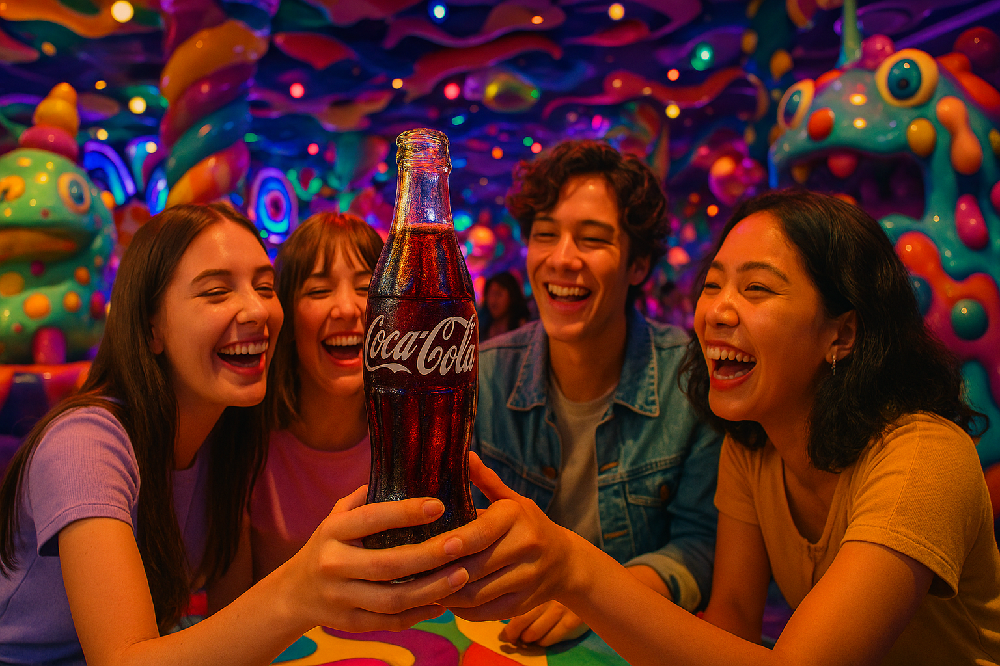
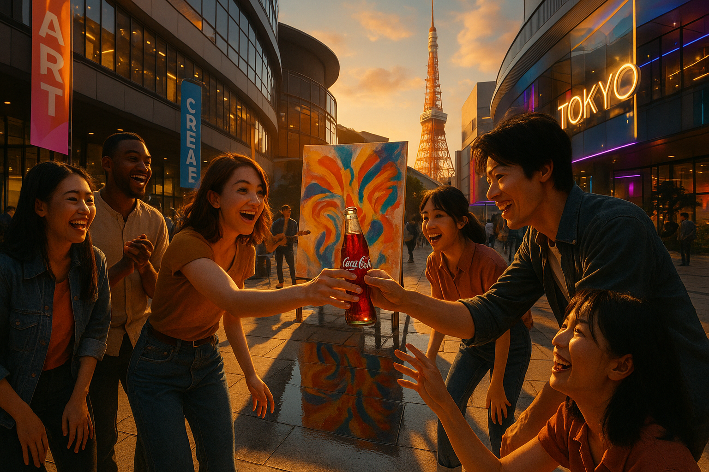

# Harajuku’s Iconic Kawaii Monster Café is Coming Back – as an Amusement Park

## Event Summary
The Kawaii Monster Café, known for its vibrant and whimsical atmosphere, is reopening as an amusement park in Harajuku. This event is expected to draw large crowds, especially among young people and tourists, due to its unique and colorful attractions.

## Marketing Potential
- **Score:** 8
- **Reasoning:** High potential. The event is visually striking and aligns well with Coca-Cola's values of happiness and togetherness. It targets a youthful audience and offers numerous opportunities for creative, colorful marketing campaigns. The immediate reopening adds urgency and timeliness.

## Creative Brief
- **Marketing Angle:** Leverage the vibrant and whimsical atmosphere of the Kawaii Monster Café amusement park to position Coca-Cola as a natural companion to this colorful experience, embodying the spirit of togetherness and joy that the park represents.
- **Target Emotion:** The exuberance and wonder of stepping into a fantastical world full of color and imagination, where every moment is a delightful surprise shared with friends.
- **Key Message:** Coca-Cola brings a splash of real magic to every colorful adventure at the Kawaii Monster Café amusement park.
- **Target Audience:** Young adventurers and tourists exploring the vibrant attractions of Harajuku's Kawaii Monster Café amusement park, seeking unique and joyful experiences.

## Text Assets
- **Slogan:** カラフルな魔法を、一緒に。
- **Social Media Post:** 🌈🎉 カワイイモンスターカフェでの冒険には、コカ・コーラが欠かせない！一緒に色とりどりの魔法を体験しよう。#カワイイ #コカコーラの魔法 #ハラジュクアドベンチャー
- **Web Banner Copy:** ハラジュクのカワイイモンスターカフェで、友達と一緒に色とりどりの魔法を体験しよう！コカ・コーラは、あなたの冒険にリアルな魔法をプラスします。🎈✨

---

# Pharrell and Nigo Team Up to Open a Massive Cultural Complex in Tokyo

## Event Summary
Pharrell Williams and Nigo are collaborating to open a large cultural complex in Tokyo, which will feature various cultural and artistic experiences. This project is expected to become a major cultural hub in the city.

## Marketing Potential
- **Score:** 7
- **Reasoning:** High potential. The involvement of high-profile figures like Pharrell and Nigo adds significant appeal and media attention. The complex is likely to attract a diverse audience interested in culture and art, aligning with Coca-Cola's themes of optimism and togetherness. The scale and cultural significance offer strong marketing opportunities.

## Creative Brief
- **Marketing Angle:** Position Coca-Cola as the catalyst for cultural connection at the new Tokyo complex, celebrating the diverse artistic expressions and creative collaborations that define the space. Leverage the brand's history of fostering shared experiences to seamlessly integrate into this hub of innovation and culture.
- **Target Emotion:** The excitement of discovering new art and culture in a vibrant, communal setting, amplified by the shared experience of enjoying a Coke with others who are equally passionate.
- **Key Message:** Coca-Cola: Creating moments of connection in the heart of Tokyo's cultural revolution.
- **Target Audience:** Culturally curious individuals and creative enthusiasts visiting the new complex, drawn by the allure of Pharrell and Nigo's visionary project in Tokyo.

## Text Assets
- **Slogan:** Coca-Cola: つながりが生まれる瞬間
- **Social Media Post:** ✨東京の新しい文化の中心地で、コカ・コーラと共にアートとクリエイティブの革命を体験しよう！🎨🥤 #文化のつながり #コカコーラ #東京の革命
- **Web Banner Copy:** 東京の新しい複合施設で、コカ・コーラと共に新たなアートと文化を発見しよう。ファレルとNIGOのビジョンが息づく場所で、つながりの瞬間を。